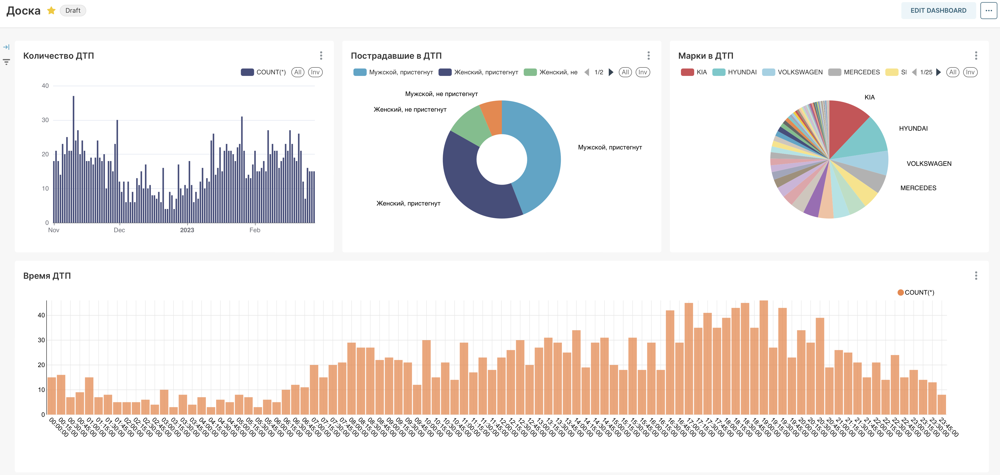
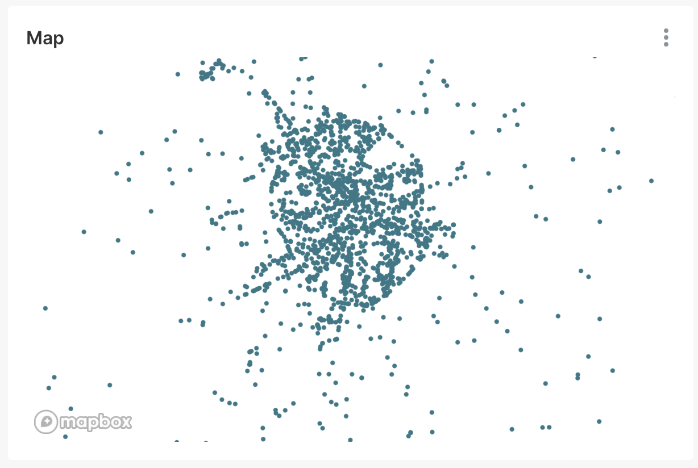
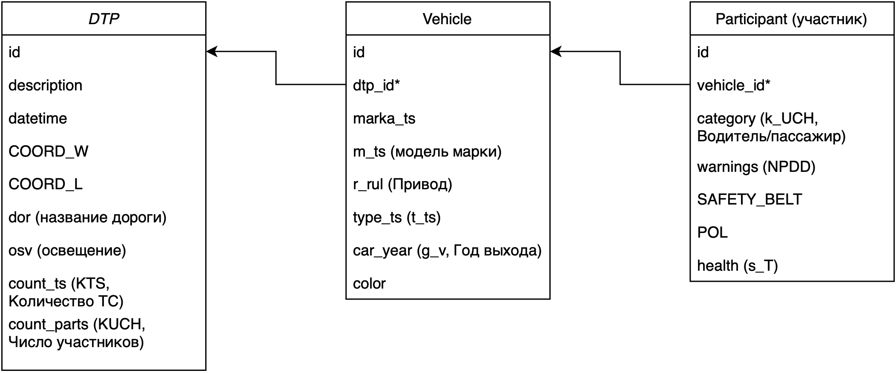

# Car_accidents

В проекте были использованы следующие инструменты:

* Python (в особенности PySpark, psycopg2, json, xmltodict)

* Hadoop

* PostgreSQL

* ApacheSuperset

Этапы загрузки данных:

1. Загрузка данных в формате xml с сайта [ГИБДД](http://stat.gibdd.ru) (Выгрузка показателей БДД – Карточки ДТП – период и показатель ДТП). В рамках данного проекта был проведен анализ с 01.11.22 – 28.02.23

2. Конвертация xml файлов в json при помощи скрипта *files.py*

3. Загрузка json файлов в hdfs – при помощи команд 
   
   ```shell
   hdfs dfs -mkdir /data
   hdfs dfs -ls /
   
   hdfs dfs -put ./data/November2022.json /data
   hdfs dfs -put ...
   ```

4. Обработка данных и загрузка из hadoop в PostgreSQL при помощи PySpark – *hdfs_to_postgres.ipynb*

5. Подключение Apache Superset к PostgreSQL и создание DashBoard.

#### Результаты работы представлены в виде графиков:





#### Диаграмма БД

Считаю, что приведение отношений ко 2 нормальной форме является достаточным в рамках данного проекта.


